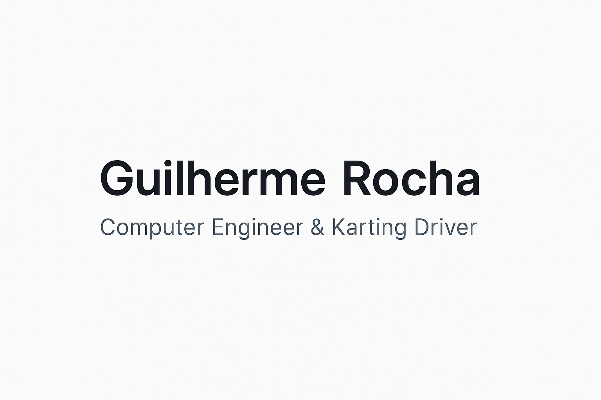

# 👋 Hey, I'm Guilherme Rocha (guizovski)

> Professional in compile errors 🛠️ | Racing through life 🏎️

## 🚀 About Me
- 🎓 Computer Engineering student @ **NOVA FCT** (2nd Year)
- 🏎️ International Karting Driver — speed runs both in circuits and code
- 💻 Passionate about software development, technology, and solving real-world problems
- 🔍 Always curious, always learning

## 🧰 Tech Stack

## 📈 GitHub Stats

## 🏆 GitHub Trophies

## 👀 Visitor Count

## 📫 Connect with me
- LinkedIn: [Coming soon 🚧]

---
_"From kart tracks to code stacks, I’m always chasing the next big win."_ 🏁
